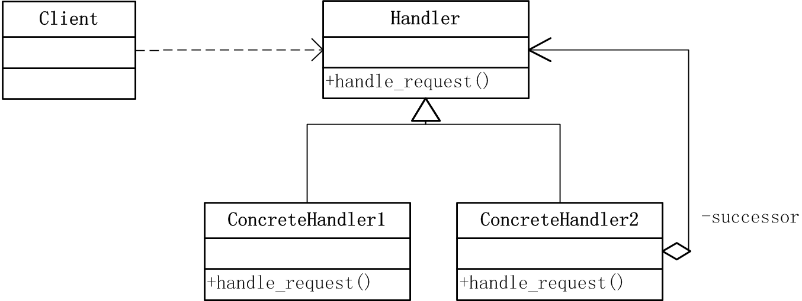
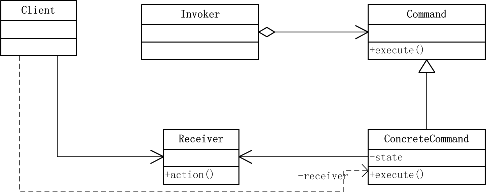
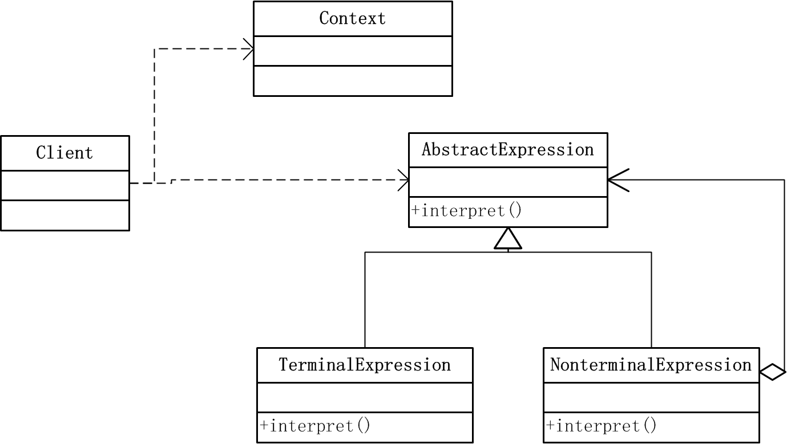
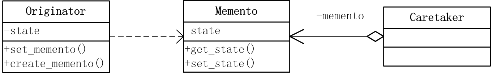
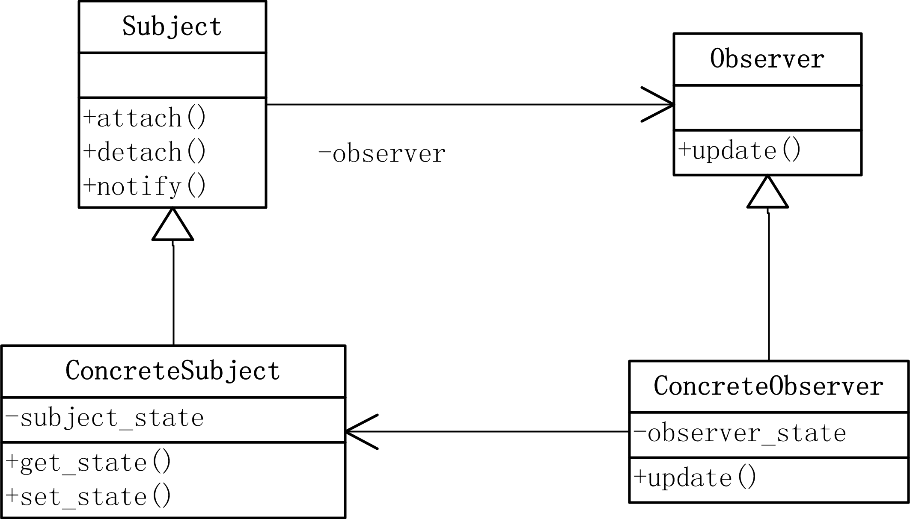
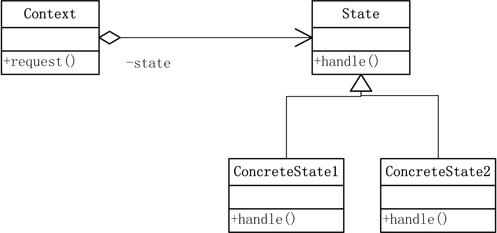
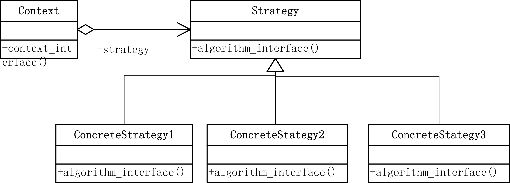
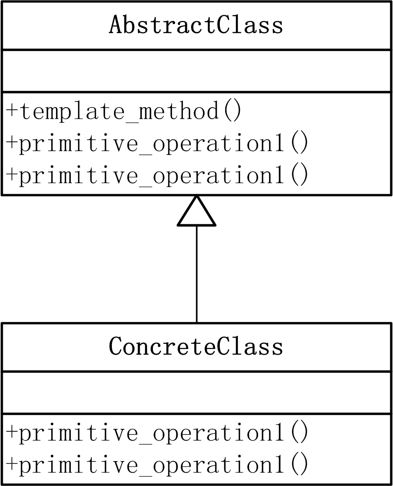
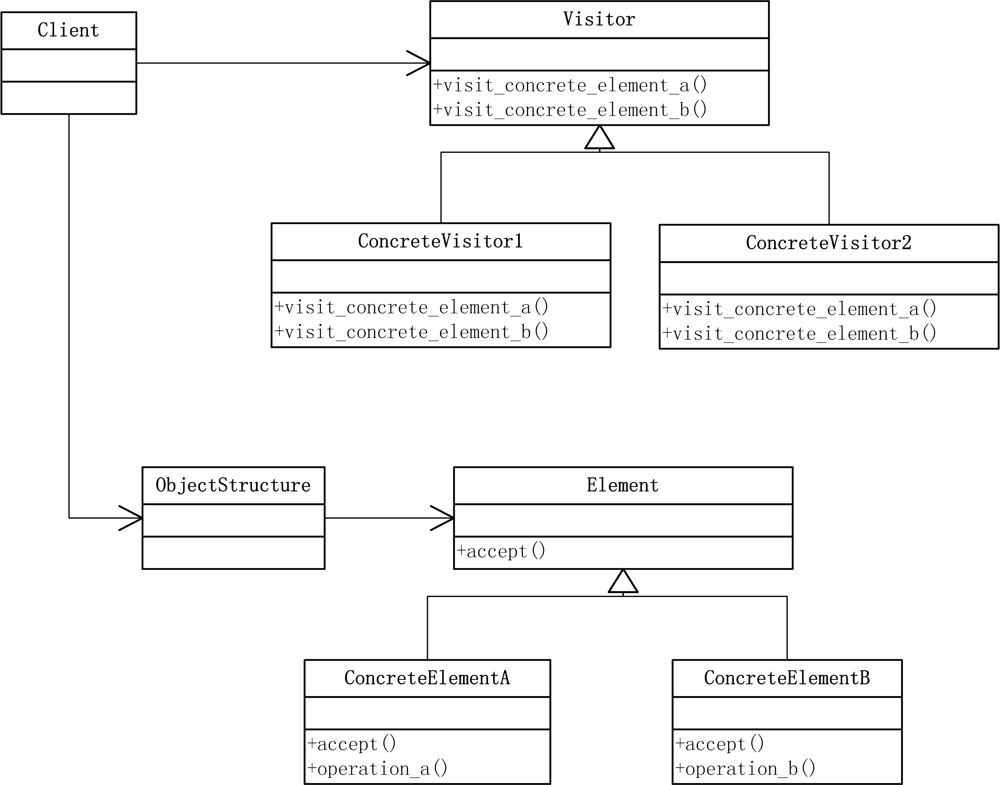

# 设计模式：Python语言实现之行为型模式

行为型模式对类和对象怎样交互和分配职责进行描述，不仅描述对象或类的模式，还描述它们之间的通信模式。按范围分为行为类模式和行为对象模式，其中类模式使用继承机制在类间分配职责，包括Interpreter和Template Method两种；而对象模式通过对象复合机制实现，包括包括Chain of Responsibility、Command、Iterator、Mediator、Memento、Observer、State、Strategy和Visitor模式。本文将分别介绍。

<!--more-->

## Chain of Responsibility (职责链) 模式

### 定义
使多个对象都有机会处理请求，从而避免请求的发送者和接收者之间的耦合关系。将这些对象连成一条链，并沿着这条链传递该请求，知道有一个对象处理它为止。

### 结构

### 参与者
- Handler：定义一个处理请求的接口
- ConcreteHandler：处理它负责的请求，可访问它的后继者，如果可处理该请求，就处理之；否则将请求转发给它的后继者。
- Client：向链上的具体处理者对象提交请求。

### 代码实现
- `handler.py`

        class Handler(object):
            def set_successor(self, successor):
                self.successor = successor
            def handle_request(self, request):
                pass

        class ConcreteHandler1(Handler):
            def handle_request(self, request):
                if request >= 0 and request <= 10:
                    print "Concrete Handler 1 handled the request " + str(request)
                elif self.successor is not None:
                    self.successor.handle_request(request)
                else:
                    print "no successor to handle it"

        class ConcreteHandler2(Handler):
            def handle_request(self, request):
                if request >= 10:
                    print "Concrete Handler 2 handled the request " + str(request)
                elif self.successor is not None:
                    self.successor.handle_request(request)
                else:
                    print "no successor to handle it"

- `client.py`

        from handler import *

        h1 = ConcreteHandler1()
        h2 = ConcreteHandler2()
        h1.set_successor(h2)

        for request in range(1,20,2):
            h1.handle_request(request)

### 适用性
- 当有多个对象都可以处理一个请求，但哪个对象处理该请求运行时刻自动确定时，使用该模式。
- 可以在不确定接收者的情况下，向多个对象中的一个提交请求
- 可以修改处理请求的结构，增加了给对象指派职责的灵活性。

----------------------------------------------------------------------------

## Command（命令） 模式

### 定义
将一个请求封装为一个对象，从而使你可用不同的请求对客户进行参数化；将请求排队或记录请求日志，以及支持可撤销的操作。

### 结构

### 参与者
- Command：声明执行操作的接口
- ConcreteCommand：将一个接收者对象绑定于一个动作，调用接收者相应的操作，以实现Execute
- Client：创建一个具体命令对象并设定它的接收者。
- Invoker：要求该命令执行这个请求
- Receiver：知道如何实施与执行一个请求相关的操作。任何类都可以作为一个接收者。

### 代码实现
- `command.py`

        class Command(object):
            def __init__(self, receiver):
                self.receiver = receiver    
            def execute(self):
                pass

        class ConcreteCommand(Command):
            def execute(self):
                self.receiver.action()

        class Invoker(object):
            def set_command(self, command):
                self.command = command

            def execute_command(self):
                self.command.execute()

        class Receiver(object):
            def action(self):
                print "action!"

- `client.py`

        from command import * 

        r = Receiver()
        c = ConcreteCommand(r)
        i = Invoker()
        i.set_command(c)
        i.execute_command()

### 适用性
- 当希望容易的设计一个命令队列，并容易的将命令计入日志
- 希望容易实现对请求的撤销与重做。
- 将请求操作的对象鱼执行操作的对象分割开。

----------------------------------------------------------------------------

## Interpreter（解释器） 模式

### 定义
给定一个语言，定义它的文法的一种表示，并定义一个解释器，这个解释器使用该表示来解释语言中的句子。是类行为型模式。

### 结构

### 参与者
- AbstractExpression：声明一个抽象的解释操作，这个接口为抽象语法树中的所有节点共享。
- TerminalExpression：终结符表达式，句子中的终结符需要该类的一个实例。
- NonterminalExpression：非终结符表达式，文法中的每一条规则都需要一个该类，对文中的非终结符实现解释操作。
- Context：包括解释器之外的一些全局信息。
- Client：构建该文法定义语言中的一个特定的句子的抽象语法树，调用解释操作。

### 代码实现
- `interpreter.py`

        class AbstractExpression(object):
            def interpret(self, context):
                pass

        class TerminalExpression(AbstractExpression):
            def interpret(self, context):
                print "terminal interpret"

        class NonterminalExpression(AbstractExpression):
            def interpret(self, context):
                print "nonterminal interpret"

        class Context(object):
            def __init__(self, arg_string):
                self.arg_string = arg_string

        def main():
            c = Context("context text")
            sentence = []
            sentence.append(NonterminalExpression())
            sentence.append(TerminalExpression())
            sentence.append(NonterminalExpression())   

            for expression in sentence:
                expression.interpret(c)

        if __name__ == '__main__':
            main()

### 适用性
- 当语言需要解释执行，并且可将该语言的句子表示为抽象语法树时，可以使用。
- 将复杂语法转换形式，使用简单的句法构建复杂的结构。

----------------------------------------------------------------------------

## Iterator（迭代器） 模式

### 定义
提供一种方法顺序访问一个聚合对象中的各个元素，而又不需要暴露该对象的内部表示。

### 结构

### 参与者
- Iterator：迭代器定义访问和遍历元素的接口。
- ConcreteIterator：具体迭代器实现迭代器接口，对该聚合遍历时跟踪当前位置。
- Aggregate：聚合定义创建相应迭代器对象的接口。
- ConcreteAggregate：具体聚合实现创建相应迭代器的接口，返回具体迭代器的一个适当实例。

### 代码实现
- `iterator.py`
        
        class Iterator(object):
            def first(self):
                pass
            
            def next(self):
                pass

            def is_done(self):
                pass

            def current_itern(self):
                pass

        class ConcreteIterator(Iterator):
            def __init__(self, aggregate):
                self.aggregate = aggregate
                self.current = 0

            def first(self):
                return self.aggregate.get(0)
            def next(self):
                self.current += 1  
                if self.current < self.aggregate.count():
                    return self.aggregate.get(self.current)

            def is_done(self):
                if self.current >= self.aggregate.count():
                    return True
                else:
                    return False

            def current_itern(self):
                return self.aggregate.get(self.current)

        class Aggregate(object):
            def create_iterator(self):
                pass

        class ConcreteAggregate(Aggregate):
            def __init__(self):
                self.list = []

            def get(self, idx):
                return self.list[idx]

            def set(self, idx, value):
                self.list.insert(idx, value)

            def count(self):
                return len(self.list)

            def create_iterator(self):
                return ConcreteIterator(self)

        def main():
            a = ConcreteAggregate()
            a.set(0,"no.1")
            a.set(1,"no.2")
            a.set(2,"no.3")

            it = a.create_iterator()

            while not it.is_done():
                print it.current_itern() + " do something"
                it.next()

        if __name__ == '__main__':
            main()

### 适用性
- 希望访问一个聚合对象的内容而无需暴露它的内部表示
- 支持对聚合对象的多种遍历
- 为遍历不同的聚合结构提供一个统一的接口 

----------------------------------------------------------------------------

## Mediator（中介者） 模式

### 定义
用一个中介对象来封装一系列对象的交互。中介者使各对象不需要显示的相互引用，从而使其耦合松散，而且可以独立的改变它们之间的交互。

### 结构

### 参与者
- Mediator：中介者定义一个接口用于与各同事对象通信。
- ConcreteMediator：具体中介者通过协调各同事对象实现协作行为，了解并维护它的各个同事
- Colleague：抽象同事类
- ConcreteColleague：具体同事类，每个同事知道它的中介者对象，不知道其他同事，需要通信时与中介者通信。

### 代码实现
- `mediator.py`

        class Mediator(object):
            def send(self, colleague, message):
                pass

        class Colleague(object):
            def __init__(self, mediator):
                self.mediator = mediator
         
        class ConcreteMediator(Mediator):
            def set_colleague(self, colleague1, colleague2):
                self.colleague1 = colleague1
                self.colleague2 = colleague2

            def send(self, colleague, message):
                if self.colleague1 is colleague:
                    self.colleague2.notify(message)
                elif self.colleague2 is colleague:
                    self.colleague1.notify(message)
                else:
                    print "no such colleague"

        class ConcreteColleague1(Colleague):
            def send(self, message):
                self.mediator.send(self, message)

            def notify(self, message):
                print "concrete colleague 1 get message: " + message

        class ConcreteColleague2(Colleague):
            def send(self, message):
                self.mediator.send(self, message)

            def notify(self, message):
                print "concrete colleague 2 get message: " + message

        def main():
            cm = ConcreteMediator()
            cc1 = ConcreteColleague1(cm)
            cc2 = ConcreteColleague2(cm)

            cm.set_colleague(cc1, cc2)

            cc1.send("hello cc2")
            cc2.send("what's up? cc1")

        if __name__ == '__main__':
            main()

### 适用性
- 一组对象以定义良好但是复杂的方式进行通信，产生的依赖关系结构混乱且难以理解。
- 定制一个分布在多个类中的行为，而又不希望太多的子类
- 一个对象引用其他很多对象并且直接与这些对象通信，导致难以复用该对象。

---------------------------------------------------------------------------

## Memento（备忘录） 模式

### 定义
在不破坏封装的前提下，捕获一个对象的内部状态，并在该对象之外保存这个状态。这样以后就可以将该对象恢复到原先保存的状态。

### 结构

### 参与者
- Memento：备忘录存储Originator对象的内部状态，防止Originator以外的其他对象访问备忘录。它只有两个接口，Caretaker只能看到其窄接口，只能将备忘传给其他对象；originator看到宽接口，可以访问其内部状态以返回到保存的状态。理想情况下只允许生成备忘的原发器访问该备忘。
- Originator：原发器创建一个备忘录，用以记录当前时刻的内部状态。使用备忘录恢复内部状态。
- Caretaker：负责保存好备忘录，不能对备忘录的内容进行操作或检查。

### 代码实现
- `memento.py`

        class Originator(object):
            def __init__(self):
                self.state = " "

            def change_state(self, state):
                self.state = state

            def show(self):
                print self.state

            def set_memento(self, memento):
                self.state = memento.state

            def create_memento(self):
                return Memento(self.state)

        class Memento(object):
            def __init__(self, state):
                self.state = state

            def get_state(self):
                return self.state

        class Craetaker(object):
            def set_memento(self, memento):
                self.memento = memento
            def get_memento(self):
                return self.memento

        def main():
            o = Originator()
            o.change_state("state 1")
            o.show()
            c = Craetaker()
            c.set_memento(o.create_memento())

            o.change_state("state 2")
            o.show()

            o.set_memento(c.get_memento())
            o.show()

        if __name__ == '__main__':
            main()

### 适用性
- 必须保存某一对象的某一时刻状态，以后需要时可以恢复到先前的状态。但是不希望让其他对象直接得到这些状态，不希望破坏对象的封装性。

---------------------------------------------------------------------------

## Observer（观察者） 模式

### 定义
定义对象间的一种一对多的依赖关系，当一个对象的状态发生改变时，所有依赖于它的对象都得到通知并被自动更新。

### 结构

### 参与者
- Subject：目标知道它的观察者，可以有任何数量的观察者，提供注册和删除观察者对象的接口。
- Observer：为目标发生改变时需获得通知的对象定义更新接口。 
- ConcreteSubject：将有关状态存入各个ConcreteObserver对象，当它的状态发生改变时，向它的各个观察者发出通知
- ConcreteObserver：维护指向ConcreteSubject对象的引用，存储有关状态，这些状态应保持与目标的状态一致，并实现Observer的自身状态更新接口。

### 代码实现
- `observer.py`
        
        class Subject(object):
            def __init__(self):
                self.observers = []

            def attach(self, observer):
                self.observers.append(observer)

            def detach(self, observer):
                self.observers.remove(observer)

            def notify(self):
                for observer in self.observers:
                    observer.update()

        class Observer(object):
            def update(self):
                pass

        class ConcreteSubject(Subject):
            def __init__(self):
                super(ConcreteSubject, self).__init__()
                self.state = ""

            def set_state(self, state):
                self.state = state

            def get_state(self):
                return self.state

        class ConcreteObserver(Observer):
            def __init__(self, subject):
                self.subject = subject
                self.state = ""

            def set_subject(self, subject):
                self.subject = subject

            def get_subject(self):
                return self.subject

            def update(self):
                self.state = self.subject.get_state()
                print self.state

        def main():
            s = ConcreteSubject()
         
            c1 = ConcreteObserver(s)
            c2 = ConcreteObserver(s)
            s.attach(c1)
            s.attach(c2)

            s.set_state("I'm back!")
            s.notify()

            s.set_state("I'm leaving!")
            s.notify()

        if __name__ == '__main__':
            main()

### 适用性
- 当一个抽象对象模型有两个方面，其中一个方面依赖于另一个方面。将这二者封装在独立的对象中以使它们可以各自独立的改变和复用。
- 当一个对象的改变需要同时改变其他对象，而又不知道具体有多少对象有待改变时。或者是当对象不是紧耦合的，即不能假定其他对象是谁时。

---------------------------------------------------------------------------

## State（状态） 模式

### 定义
允许一个对象在其内部状态改变时改变它的行为，看起来似乎修改了它的类。

### 结构

### 参与者
- Context：定义客户感兴趣的接口，维护一个ConcreteState子类的实例，这个实例定义了当前的状态。
- State：定义一个接口以封装与context的一个特定状态相关的行为。
- ConcreteState：每一个子类实现一个与Context的一个状态相关的行为。

### 代码实现
- `state.py`

        class State(object):
            def handle(self, context):
                pass

        class ConcreteState1(State):
            def handle(self, context):
                next_state = ConcreteState2()
                context.set_state(next_state)

        class ConcreteState2(State):
            def handle(self, context):
                next_state = ConcreteState1()
                context.set_state(next_state)

        class Context(object):
            def __init__(self, state):
                self.state = state

            def set_state(self, state):
                self.state = state
                print "self.state is " + self.state.__class__.__name__

            def get_state(self):
                return self.state

            def request(self):
                self.state.handle(self)
                
        def main():
            s1 = ConcreteState1()
            c = Context(s1)
            c.request()
            c.request()
            c.request()
            c.request()

        if __name__ == '__main__':
            main()

### 适用性
- 当一个对象的行为取决于它的状态，并且必须在运行时刻根据状态改变行为，希望把状态和行为分割开来。
- 当一个操作中有大量的分支和条件语句时，且这些分支依赖于对象的状态。该模式将不同状态下的分支分别放入一个独立的类中，可以根据自身情况将对象的状态作为对象，而该对象不依赖于其他对象而独立变化。

---------------------------------------------------------------------------

## Strategy（策略） 模式

### 定义
定义一系列的算法，把他们一个一个封装起来，并且使他们可以互相替换。使算法可独立于它的客户端而变化。

### 结构

### 参与者
- Strategy：定义所有支持的算法的公共接口，Context使用这个接口调用某ConcreteStrategy定义的算法
- ConcreteStrategy：实现具体接口的算法类
- Context：用一个ConcreteStrategy来配置，维护一个对Strategy的引用，定义一个接口来让Strategy访问它的数据库。

### 代码实现
- `strategy.py`

        class Strategy(object):
            def algorithm_interface(self):
                pass

        class ConcreteStrategy1(Strategy):
            def algorithm_interface(self):
                print "algorithm 1 "

        class ConcreteStrategy2(Strategy):
            def algorithm_interface(self):
                print "algorithm 2 "

        class ConcreteStrategy3(Strategy):
            def algorithm_interface(self):
                print "algorithm 3 "

        class Context(object):
            def __init__(self, cs):
                self.s = Strategy()
                self.s = cs

            def context_interface(self):
                self.s.algorithm_interface()

        def main():
            cs1 = ConcreteStrategy1()
            c = Context(cs1)
            c.context_interface()

            cs2 = ConcreteStrategy2()
            c = Context(cs2)
            c.context_interface()

            cs3 = ConcreteStrategy3()
            c = Context(cs3)
            c.context_interface()

        if __name__ == '__main__':
            main()

### 适用性
- 但许多相关类仅仅是行为有异。
- 需要使用一个算法的不同变体，或定义了多种行为，并且这些行为在这个类的操作中以多个条件语句的形式出现。

---------------------------------------------------------------------------

## Template Method（模板方法） 模式

### 定义
模板方法是类行为型模式。定义一个操作中的算法和骨架，而将一些步骤延迟到子类中，该模式可以不改变一个算法的结构即可重定义该算法的某些特地步骤。

### 结构

### 参与者
- AbstractClass：定义抽象的原语操作（primitive operation），具体的子类将重新定义它们以实现一个算法的各步骤。实现一个模板方法，定义一个算法的骨架。
- ConcreteClass：具体实现原语操作中的特定步骤和算法

### 代码实现
- `template_method.py`

        class AbstractClass(object):
            def primitive_operation1(self):
                pass

            def primitive_operation1(self):
                pass

            def template_method(self):
                self.primitive_operation1()
                self.primitive_operation2()
                print "!!"

        class ConcreteClass1(AbstractClass):
            def primitive_operation1(self):
                print "class 1 operation 1 "
            def primitive_operation2(self):
                print "class 1 operation 2 "

        class ConcreteClass2(AbstractClass):
            def primitive_operation1(self):
                print "class 2 operation 1 "
            def primitive_operation2(self):
                print "class 2 operation 2 "

        def main():
            c = ConcreteClass1()
            c.template_method()

            c = ConcreteClass2()
            c.template_method()

        if __name__ == '__main__':
            main()

### 适用性
- 将步骤等共同部分通过模板方法一次实现，避免重复。
- 算法的可变部分由子类实现。

---------------------------------------------------------------------------

## Visitor（访问者） 模式

### 定义
表示一个作用于某对象结构中的各元素的操作，它使你可以在不改变各元素的类型的前提下定义作用于这些元素的新操作。

### 结构

### 参与者
- Visitor：为给对象结构中的ConcreteElement的每一个类声明一个Visit操作，该操作的名字和特征标识了发起Visit请求给访问者的那个类，使得访问者可以确定正被访问的元素的具体的类。
- ConcreteVisitor：实现每个Visitor声明的操作。
- Element：定义一个Accept操作，以一个访问者为参数。
- ConcreteElement：实现Accept操作，以访问者为参数。
- ObjectStructure：枚举它的元素，提供高层接口以允许该访问者访问它的元素。

### 代码实现
- `visitor.py`

        class Visitor(object):
            def visit_concrete_element_a(self, concrete_element_a):
                pass
            def visit_concrete_element_b(self, concrete_element_b):
                pass

        class ConcreteVisitor1(Visitor):
            def visit_concrete_element_a(self, concrete_element_a):
                print concrete_element_a.__class__.__name__ + " is visited by " + self.__class__.__name__
            def visit_concrete_element_b(self, concrete_element_b):
                print concrete_element_b.__class__.__name__ + " is visited by " + self.__class__.__name__

        class ConcreteVisitor2(Visitor):
            def visit_concrete_element_a(self, concrete_element_a):
                print concrete_element_a.__class__.__name__ + " is visited by " + self.__class__.__name__
            def visit_concrete_element_b(self, concrete_element_b):
                print concrete_element_b.__class__.__name__ + " is visited by " + self.__class__.__name__

        class Element(object):
            def accept(self, visitor):
                pass

        class ConcreteElementA(Element):
            def accept(self, visitor):
                visitor.visit_concrete_element_a(self)
            def operation(self):
                pass

        class ConcreteElementB(Element):
            def accept(self, visitor):
                visitor.visit_concrete_element_b(self)
            def operation(self):
                pass

        class ObjectStructure(object):
            def __init__(self):
                self.elements = []

            def attach(self, element):
                self.elements.append(element)

            def detach(self, element):
                self.elements.remove(element)

            def accept(self, visitor):
                for element in self.elements:
                    element.accept(visitor)

        def main():
            o = ObjectStructure()
            o.attach(ConcreteElementA())
            o.attach(ConcreteElementB())

            v1 = ConcreteVisitor1()
            v2 = ConcreteVisitor2()

            o.accept(v1)
            o.accept(v2)

        if __name__ == '__main__':
            main()

### 适用性
- 需要对一个对象的结构中的对象进行很多不同的并且不相关的操作，visitor让相关操作集中到一个类中。
- 需要把处理从数据结构中分离出来。

---------------------------------------------------------------------------
### 参考
- [设计模式-可复用面向对象软件的基础](http://book.douban.com/subject/1052241/) 
- [大话设计模式](http://book.douban.com/subject/2334288/)
- [Thinking in python](http://docs.linuxtone.org/ebooks/Python/Thinking_In_Python.pdf)