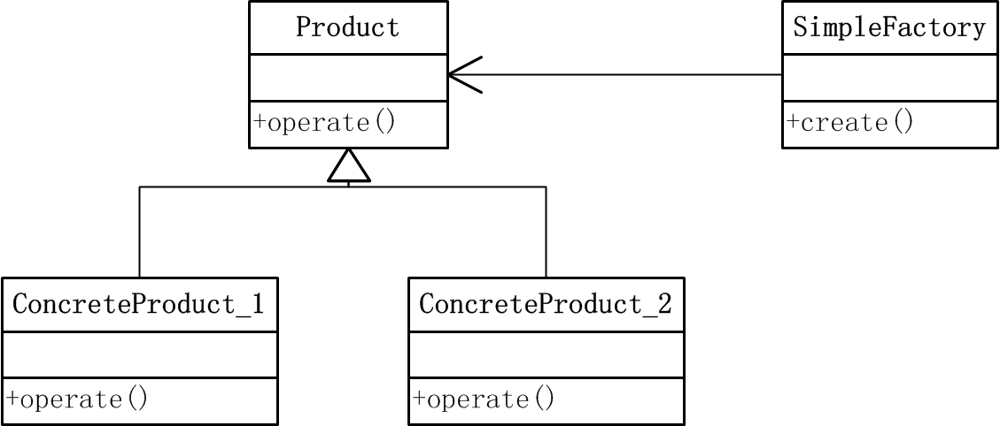
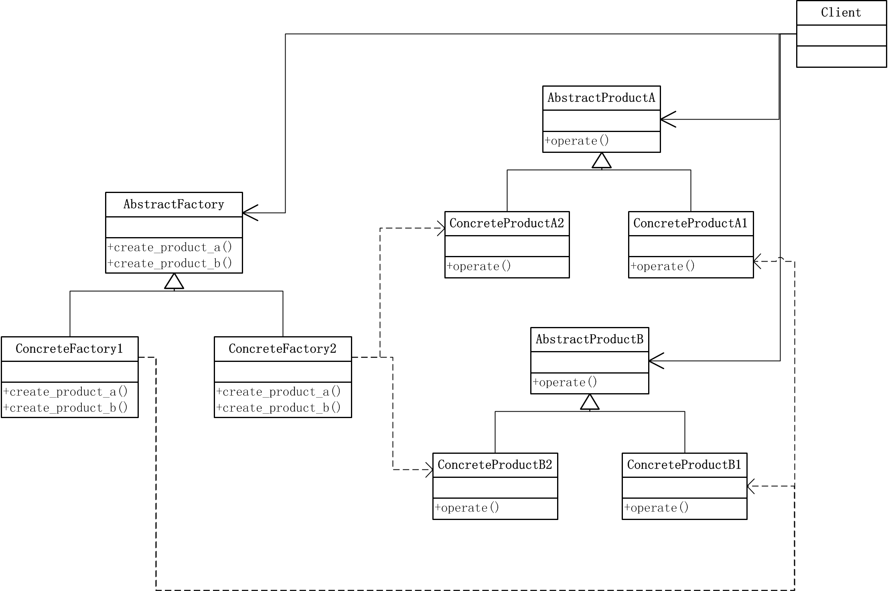

# 设计模式：Python语言实现之创建型模式

## simple factory 模式

### 定义
简单工厂模式是属于创建型模式，又叫做静态工厂方法（Static Factory Method）模式，是由一个工厂对象决定创建出哪一种产品类的实例。

### 结构

### 参与者
- 抽象产品（Product）：所创建产品的父类，用于描述所有实例具有的公共接口
- 具体产品（ConcreteProduct）：所创建产品的具体类，实现公共接口，产生具体实例。
- 简单工厂（SimpleFactory）：负责实现创建实例的内部逻辑逻辑，直接被外部调用，创建所需产品对象

### 代码实现
- 抽象产品（`product.py`）
 
	    class Product(object):
            """a base class to define common interfaces"""
            def operate(self):
                pass

- 具体产品（`concrete_product_1.py` & `concrete_product_2.py`）

	    from product import *
        class ConcreteProduct_1(Product):
            """a concrete product class to implement common interfaces"""
            def operate(self):
                print "operation implemented by ConcreteProduct_1"
	
	    from product import *
        class ConcreteProduct_2(Product):
            """a concrete product class to implement common interfaces"""
            def operate(self):
                print "operation implemented by ConcreteProduct_2"

- 简单工厂（`simple_factory.py`）

        from concrete_product_1 import *
        from concrete_product_2 import *

        class SimpleFactory(object):
            """SimpleFactory to create concrete pruduct"""
            def create(self,option):
                if option == "product 1":
                    return ConcreteProduct_1()
                elif option == "product 2":
                    return ConcreteProduct_2()
                else: 
                    return None

- 客户端使用示例（`use_sim_fac.py`）

        from simple_factory import SimpleFactory

        fac = SimpleFactory()
        product = fac.create("product 2")
        if product != None:
            product.operate()

### 优缺点

- 优点：简单工厂模式中，工厂类实现逻辑，根据外界信息决定创建哪个具体类的实例，避免客户端程序直接创建具体实例。
- 缺点：工厂类是该模式的核心，承担了太重要的角色，工厂类能够正常工作影响全部逻辑。此外，如需增加和扩展业务时需更改工厂类，违反开放-封闭的原则。

--------------------------------------------------------------------------------

## factory method 模式

### 定义
工厂方法模式又叫做虚构造器，它定义一个用于创建对象的接口，让子类决定实例化哪一个对象。该模式使一个类的实例化延迟到其子类。

### 结构

### 参与者
- 抽象产品（Product）：所创建产品的父类，用于描述所有实例具有的公共接口
- 具体产品（ConcreteProduct）：所创建产品的具体类，实现公共接口，产生具体实例。
- 抽象创建者（Creator）：声明工厂方法，返回Product类型对象。
- 具体创建者（ConcreteCreator）：定义具体工厂方法，返回具体ConcreteProduct实例。

### 代码实现
- 产品类 （`product.py`）

        #  abstract product
        class Product(object):
            """a base class to define common interfaces"""
            def operate(self):
                pass

        # concrete product
        class ConcreteProduct_1(Product):
            """a concrete product class to implement common interfaces"""
            def operate(self):
                print "operation implemented by ConcreteProduct_1"

        class ConcreteProduct_2(Product):
            """a concrete product class to implement common interfaces"""
            def operate(self):
                print "operation implemented by ConcreteProduct_2"

- 创建者类 （`creator.py`）
        
        from product import *

        # abstract creator
        class Creator(object):
            """a base creator to define factory method"""
            def create(self):
                pass

        # concrete creator
        class ConcreteCreator_1(Creator):
            """ a concrete creator to implement factory method"""
            def create(self):
                return ConcreteProduct_1()

        class ConcreteCreator_2(Creator):
            """ a concrete creator to implement factory method"""
            def create(self):
                return ConcreteProduct_2()

- 客户端 （`client.py`）

        import random
        from product import *
        from creator import *

        # choice concrete creator manually
        mycreator = ConcreteCreator_1()
        myproduct = mycreator.create()
        myproduct.operate()

        # choice concrete creator randomly
        def genefac(n):
            for i in range(n):
                yield random.choice(Creator.__subclasses__())

        mycreators = [i() for i in genefac(10)]
        myproducts = [i.create() for i in mycreators]

        for i in myproducts:
            i.operate()

### 优缺点
- 优点：工厂方法模式将简单工厂中工厂类的逻辑交由客户端，客户端选择具体工厂类进行具体产品的实例化，当增加新的产品时，不需要更改抽象工厂类，只需实现新的具体工厂类即可，封装性和可扩展性好
- 缺点：当应用本身逻辑简单时，相对于简单工厂方法，其编码较多，额外开销大。

--------------------------------------------------------------------------------

## abstract factory 模式

### 定义
抽象工厂模式，又叫kit模式，提供一个创建一系列相关或相互依赖对象的接口，而无需指定它们具体的类。适用于具有多个产品系列的应用情况。

### 结构

### 参与者
- 抽象工厂（AbstractFactory）：声明一个创建抽象对象产品的操作接口。
- 具体工厂（ConcreteFactory）: 实现创建具体产品对象的操作
- 抽象产品（AbstractProduct）：为一类产品对象声明接口
- 具体产品（ConcreteProduct）：定义一个将被相应工厂创建的产品对象，实现抽象产品接口
- 客户端（Client）：仅使用由抽象工厂和抽象产品声明的接口。

### 代码实现
- 产品类

        # abstract product A

        class AbstractProductA(object):
            def operate(self):
                pass

        # concrete product A

        class ConcreteProductA1(AbstractProductA):
            def operate(self):
                print "operate by ConcreteProductA1"

        class ConcreteProductA2(AbstractProductA):
            def operate(self):
                print "operate by ConcreteProductA2"

        # abstract product B

        class AbstractProductB(object):
            def operate(self):
                pass

        # concrete product B

        class ConcreteProductB1(AbstractProductB):
            def operate(self):
                print "operate by ConcreteProductB1"

        class ConcreteProductB2(AbstractProductB):
            def operate(self):
                print "operate by ConcreteProductB2"

- 工厂类

        from product import *

        # abstract factory

        class AbstractFactory(object):
            def create_product_a(self):
                pass
            def create_product_b(self):
                pass

        # concrete factory

        class ConcreteFactory1(AbstractFactory):
            def create_product_a(self):
                return ConcreteProductA1()
            def create_product_b(self):
                return ConcreteProductB1()

        class ConcreteFactory2(AbstractFactory):
            def create_product_a(self):
                return ConcreteProductA2()
            def create_product_b(self):
                return ConcreteProductB2()

- 客户端

        import random
        from product import *
        from factory import *

        # choice concrete factory manually
        fac = ConcreteFactory1()
        prod = fac.create_product_a()
        prod.operate()

        # choice concrete factory randomly
        def genfac(n):
            for i in range(n):
                yield random.choice(AbstractFactory.__subclasses__())

        facs = [i() for i in genfac(10)]

        prods = []
        [prods.extend([i.create_product_a(), i.create_product_b()]) for i in facs]

        for i in prods:
            i.operate()

### 优缺点
- 优点：该模式方便改变产品系列，只改变具体工厂就可以配置不同的产品系列。
- 缺点：使用该模式增加新的产品时，由于抽象工厂定义了所有可生产产品的集合，因此需要更改所有工厂类以实现增加产品的目的，开销较大。