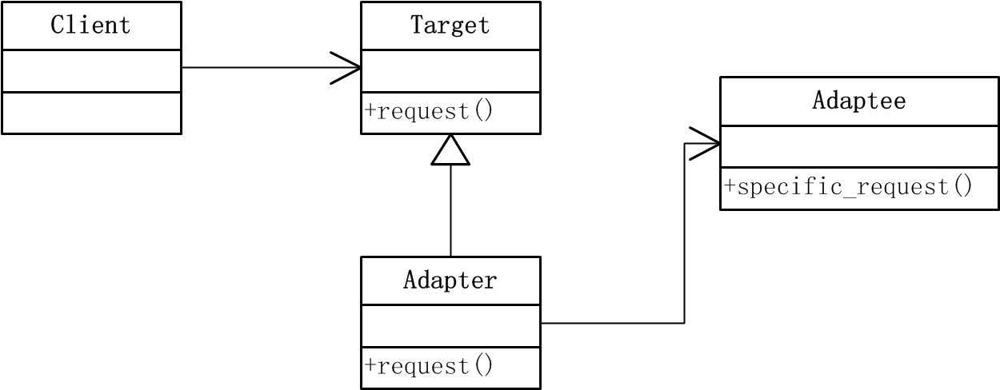
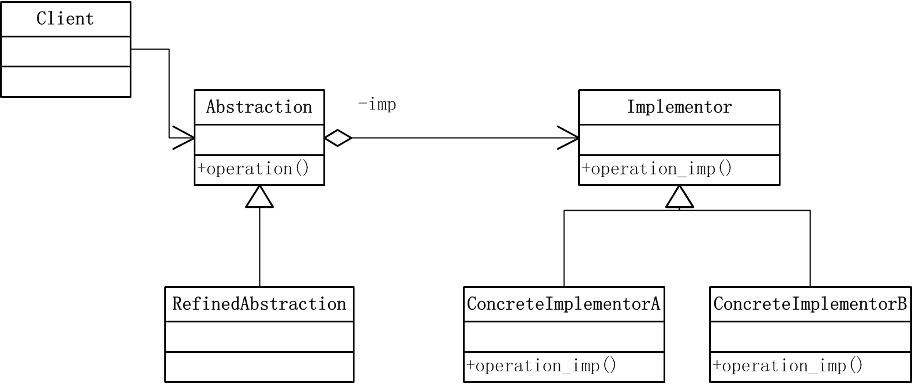
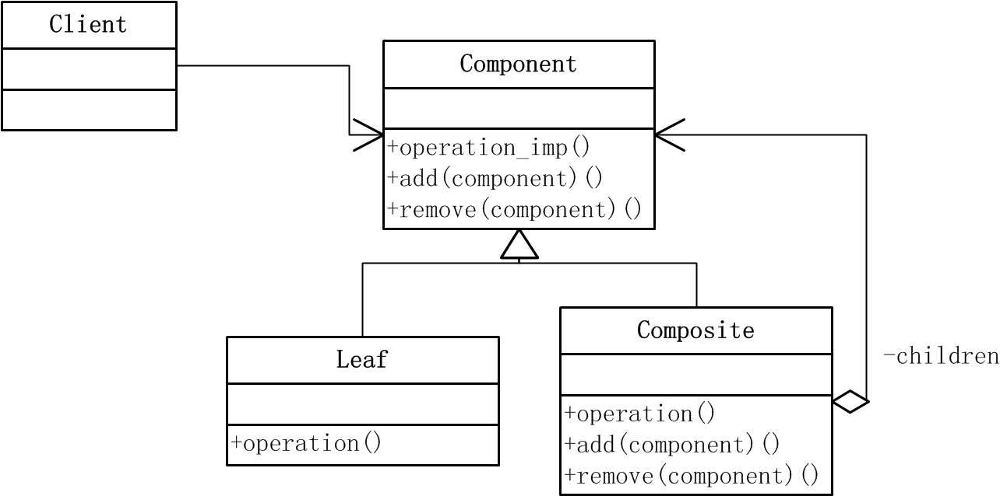
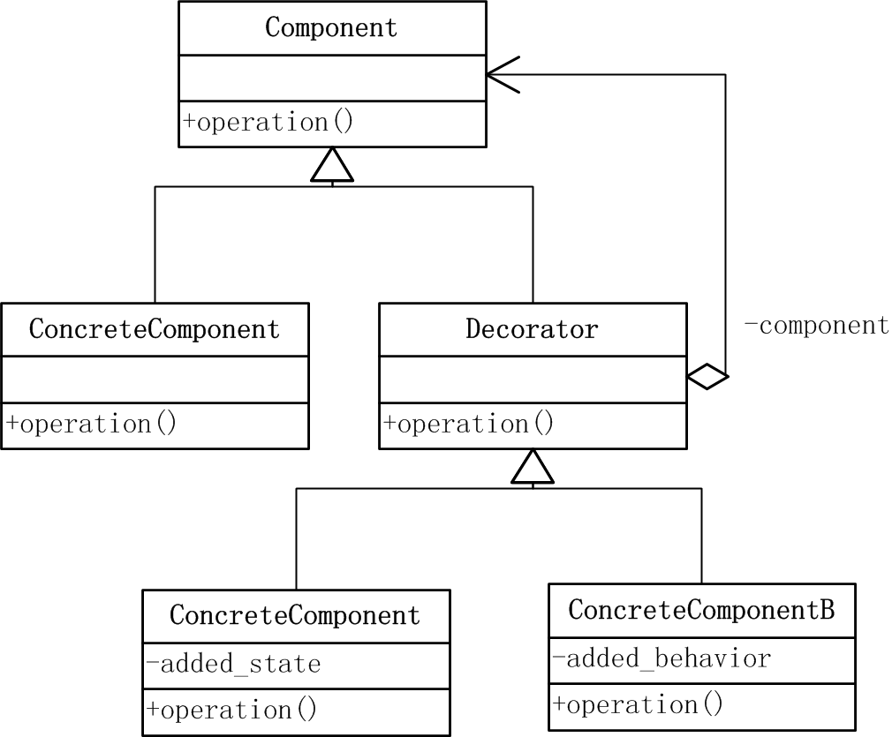
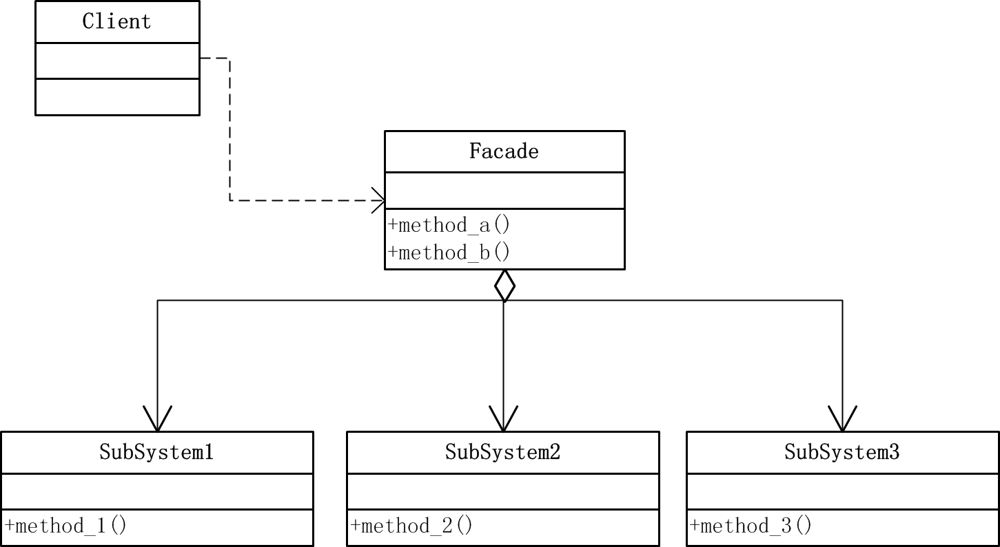
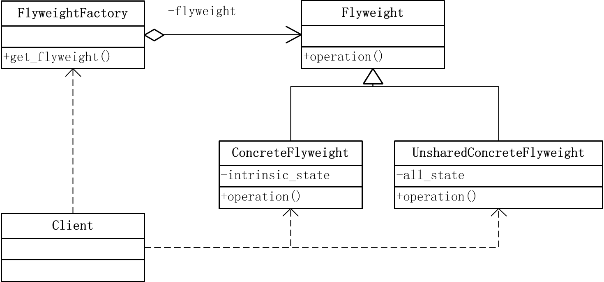
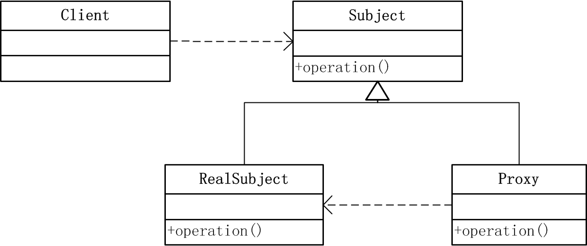

# 设计模式：用python实现之结构型模式

结构型模式涉及到如何组合类和对象以获得更大的结构。本文将给出结构型模式的定义，结构，代码实现和特点等内容。本文涉及的结构型模式包括：adapter模式，bridge模式，composite模式，decorator模式，facade模式，flyweight模式，和proxy模式。

<!--more-->

## Adapter（适配器）模式

### 定义
将一个类的接口转换成客户希望的另外一个接口。Adapter模式使得原本由于接口不兼容而不能一起工作的那些类可以一起工作。

### 结构

### 参与者
- Target: 客户所期待的与特定领域相关的接口。
- Adaptee: 需要适配的类，是一个已存在的接口。
- Adapter：对Adaptee的接口与Target接口进行适配。
- Client：客户端，与复合Target接口的对象协同。

### 代码实现
- Target类（`target.py`）

        class Target(object):
            def request(self):
                print "nomal request"

- Adaptee类（`adaptee.py`）

        class Adaptee(object):
            def specific_request(self):
                print "specific request"

- Adapter类（`adapter.py`）
        
        from target import *
        from adaptee import *

        class Adapter(Target):
            def __init__(self):
                self.myadaptee = Adaptee()

            def request(self):
                self.myadaptee.specific_request()

- 客户端（`client.py`）

        from adapter import *

        target = Adapter()
        target.request()

### 适用性
- 想使用一个已经存在的类，而他的接口不符合你的要求时可以使用此模式。
- 客户端代码可以统一调用同一接口，即使是对不相关或不可预见的类。

----------------------------------------------------------------------------

## Bridge（桥接）模式

### 定义
将抽象部分与它的实现部分分离，使它们都可以独立的变化。

### 结构

### 参与者
- Abstraction: 定义抽象类的接口，维护一个指向Implementor类对象的指针。
- RefinedAbstraction：扩充Abstraction定义的接口。
- Implementor: 定义实现类的接口，该接口不一定要与Abstraction的接口一致，该类接口提供基本操作，Abstraction类定义了基于这些基本操作的较高层次的操作。
- ConcreteImplementor：具体实现Implementor的接口。

### 代码实现
- Implementor 类（`Implementor.py`）

        class Implementor(object):
            def operation_imp(self):
                pass

        class ConcreteImplementorA(Implementor):
            def operation_imp(self):
                print "ConcreteImplementorA operate"

        class ConcreteImplementorB(Implementor):
            def operation_imp(self):
                print "ConcreteImplementorB operate"

- Abstraction 类（`abstraction.py`）
        from implementor import *

        class Abstraction(object):
            def __init__(self):
                self.imp = Implementor()

            def set_imp(self,conc_imple):
                self.imp = conc_imple;

            def operate(self):
                self.imp.operation_imp()
    
- client （`client.py` ）

        from abstraction import *
        from implementor import *

        ab = Abstraction()
        imp = ConcreteImplementorA()
        ab.set_imp(imp)
        ab.operate()

### 适用性

- 不希望抽象与实现部分有一个固定的绑定，该模式可以在运行时刻配置抽象类的实现。
- 希望抽象部分和实现部分都可通过子类进行扩充。该模式可以独立的对抽象与实现分别扩充。
- 希望实现系统的多角度分类，减少各分类之间的耦合。

---------------------------------------------------------------------------

## Composite（组合）模式

### 定义
将对象组合成树形结构以表示“部分-整体”的层次结构。该模式使得用户对单个对象和组合对象的使用具有一致性。

### 结构

### 参与者
- Component：为组合中的对象声明接口，在适当情况下实现所有类公有接口的缺省行为，声明一个用于管理Component的子组件
- Leaf：在组合中表示叶节点对象，叶节点没有子节点。
- Composite：定义有子部件的那些部件的行为，存储子部件，实现接口中与子部件有关的操作
- Client：通过Component接口操作组合部件对象。
- 协作： 用户使用Component接口与组合结构中的对象进行交互，如果接受者是一个叶节点，则直接处理请求，如果接受者是Composite，它通常将请求发送给它的子部件，并执行一些辅助动作。 

### 代码实现
- (`composite.py`）

        class Component(object):
            def operation(self,depth):
                pass

            def add(self, component):
                pass

            def remove(self, component):
                pass

        # Leaf
        class Leaf(Component):
            def operation(self, depth):
                print "-"*depth + "leaf"

        # Composite
        class Composite(Component):
            def __init__(self):
                self.children = []

            def operation(self, depth):
                print "-"*depth + "composite"
                for c in self.children:
                    c.operation(depth+2)

            def add(self, component):
                self.children.append(component)

            def remove(self, component):
                self.children.remove(component)

- Client（`client.py`）

        from composite import *

        comp1 = Composite()
        comp1.add(Leaf())
        comp1.add(Leaf())

        root = Composite()
        leaf = Leaf()
        root.add(leaf)
        root.add(comp1)

        root.operation(2)

        root.remove(leaf)
        root.operation(2)

### 适用性
- 希望表达对象的部分-整体层次结构，且希望用户忽略组合对象与单个对象的不同并统一的使用组合结构中的所有对象时。
- 使设计更加一般化，并且容易增加新的组件，客户端不需根据新组间而改变。

---------------------------------------------------------------------------

## Decorator（装饰）模式

### 定义
该模式也叫Wrapper（包装器），动态的给一个对象添加一些额外的职责。就增加功能来说，该模式比生成子类更为灵活。

### 结构

### 参与者
- Component：定义一个对象接口，可以给这些对象动态的添加职责。
- ConcreteComponent：定义一个对象，可以给这个对象添加一些职责。
- Decorator：维持一个指向Component对象的指针，并定义一个与Component接口一致的接口。
- ConcreteDecorator：具体的装饰对象，向组件添加职责。

### 代码实现
- Component类（`component.py`）

        class Component(object):
            def operation(self):
                pass

        class ConcreteComponent(Component):
            def operation(self):
                print "concrete component operate"

- Decorator类（`decorator.py`）
    
        from component import *

        class Decorator(Component):
            def __init__(self):
                self.comp = Component()

            def set_component(self, component):
                self.comp = component

            def operation(self):
                self.comp.operation()

        class ConcreteDecoratorA(Decorator):
            def __init__(self):
                super(ConcreteDecoratorA, self).__init__()
                self.added_state = " "

            def operation(self):
                super(ConcreteDecoratorA, self).operation()
                self.added_state += "new state"
                print self.added_state

        class ConcreteDecoratorB(Decorator):
            def __init__(self):
                super(ConcreteDecoratorB, self).__init__()
            
            def operation(self):
                super(ConcreteDecoratorB, self).operation()

            def added_behavior(self):
                print "added behavior"      
    
- 客户端（`client.py`）

        from decorator import *

        c = ConcreteComponent()
        d1 = ConcreteDecoratorA()
        d2 = ConcreteDecoratorB()

        d1.set_component(c)
        d2.set_component(d1)

        d2.operation()

### 适用性
- 希望不影响其他对象的情况下，以动态，透明的方式给单个对象添加职责，比静态继承更灵活。
- 把类的核心职责和装饰功能区分开来，去除类中重复的装饰逻辑。

---------------------------------------------------------------------------

## Facade（外观）模式

### 定义
为子系统中的一组接口提供一个一致的界面，该模式定义了一个高层接口，这个接口使得这一子系统更加容易使用。

### 结构

### 参与者
- Facade：知道哪些子系统负责处理请求，将客户的请求代理给合适的子系统对象。
- SubSystem：实现子系统的功能，处理Facade对象指派的任务，无需Facade对象的任何信息。

### 代码实现
- SubSystem类（`subsystem.py`）
        
        class SubSystem1(object):
            def method1(self):
                print "sub system 1 method 1"

        class SubSystem2(object):
            def method2(self):
                print "sub system 2 method 2"

        class SubSystem3(object):
            def method3(self):
                print "sub system 3 method 3"

- Facade类（`facade.py`）

        from subsystem import *

        class Facade(object):
            def __init__(self):
                self.sub1 = SubSystem1()
                self.sub2 = SubSystem2()
                self.sub3 = SubSystem3()

            def method_a(self):
                self.sub1.method1()
                self.sub3.method3()
                self.sub2.method2()

            def method_b(self):
                self.sub3.method3()
                self.sub2.method2()
                self.sub1.method1()

- client（`client.py`）

        from facade import *

        fc = Facade()
        fc.method_a()
        fc.method_b()

### 适用性
- 希望复杂的系统提供简单的接口时，从更高层次上操作组合各子系统。
- 希望减少客户程序与抽象类的实现部分之间的依赖性，可以入facade层。

---------------------------------------------------------------------------

## Flyweight（享元）模式

### 定义
运用共享技术有效的支持大量的细粒度对象。

### 结构

### 参与者
- Flyweight：描述一个接口，通过这个接口flyweight可以接受并作用于外部状态。
- ConcreteFlyweight：实现Flyweight接口，并为内部状态增加存储空间，其对象必须是可共享的。
- UnsharedConcreteFlyweight：Flyweight接口使共享成为可能，但是并不强制共享。该类指那些不需要被共享的子类。
- FlyweightFactory：创建并管理Flyweight对象，确保合理的共享Flyweight对象。
- client：维持一个对Flyweight的引用，计算或存储一个或多个flyweight的内部状态。

### 代码实现
- flyweight.py

        class Flyweight(object):
            def operation(self, extrainsicstate):
                pass

        class ConcreteFlyweight(Flyweight):
            def operation(self, extrainsicstate):
                print "concrete flyweight" + str(extrainsicstate)

        class UnsharedConcreteFlyweight(Flyweight):
            def operation(self, extrainsicstate):
                print "unshared concrete flyweight" + str(extrainsicstate)

        class FlyweightFactory(object):
            def __init__(self):
                self.flyweights = {}

            def get_flyweight(self, key):
                if self.flyweights.has_key(key):
                    return self.flyweights[key]
                else:
                    fw = ConcreteFlyweight()
                    self.flyweights[key] = fw
                    return fw

- client.py
        
        from flyweight import *

        extrinsicstate = 20
        f = FlyweightFactory()
        fx = f.get_flyweight("x")
        fx.operation(extrinsicstate-1)

        fy = f.get_flyweight("y")
        fy.operation(extrinsicstate-1)

        uf = UnsharedConcreteFlyweight()
        uf.operation(extrinsicstate-2)

### 适用性
- 当一个程序使用了大量的对象，造成很大的存储开销时。
- 对象的大多数状态都可变为外部状态，如果删除外部对象则可使用较少的共享对象取代很多组对象。

---------------------------------------------------------------------------

## Proxy（代理）模式

### 定义
为其他对象提供一种代理以控制对这个对象的访问。

### 结构

### 参与者
- Proxy：保存一个引用，使得代理可以访问实体，提供与Subject相同的接口，代理就可以代替实体，控制对实体的新建、存储、删除。
- Subject：定义Proxy与RealSubject的公用接口。
- RealSubject：实体类。

### 代码实现
- `proxy.py`

        class Subject(object):
            def operation(self):
                pass

        class RealSubject(Subject):
            def operation(self):
                print "real subject operation"

        class Proxy(Subject):
            def __init__(self):
                self.rs = RealSubject()

            def operation(self):
                self.rs.operation()

- `client.py` 

        from proxy import *

        proxy = Proxy()
        proxy.operation() 

### 适用性
- 远程代理：为一个在不同地址空间的对象提供局部代表。
- 虚代理：需要创建开销很大的对象时，通过代理存放真实对象。
- 保护代理：控制对原来对象的访问。
- 智能指引：代理处理附加操作

---------------------------------------------------------------------------

## 几种结构型模式的讨论
- Adapter和Bridge模式都给另一对象提供了一定程度上的间接性，有利于系统的灵活性。二者不同在于Adapter主要解决已有接口之间的不匹配问题，而bridge模式则是对抽象接口和实现部分进行桥接。
- Composite和Decorator模式具有类似的结构图，都基于递归组合来组织可变数目的对象。但Decorator旨在不需要生成子类即可给对象添加职责；而composite则旨在构造类，重点在表示不在装饰。

---------------------------------------------------------------------------
### 参考
- [设计模式-可复用面向对象软件的基础](http://book.douban.com/subject/1052241/) 
- [大话设计模式](http://book.douban.com/subject/2334288/)
- [Thinking in python](http://docs.linuxtone.org/ebooks/Python/Thinking_In_Python.pdf)